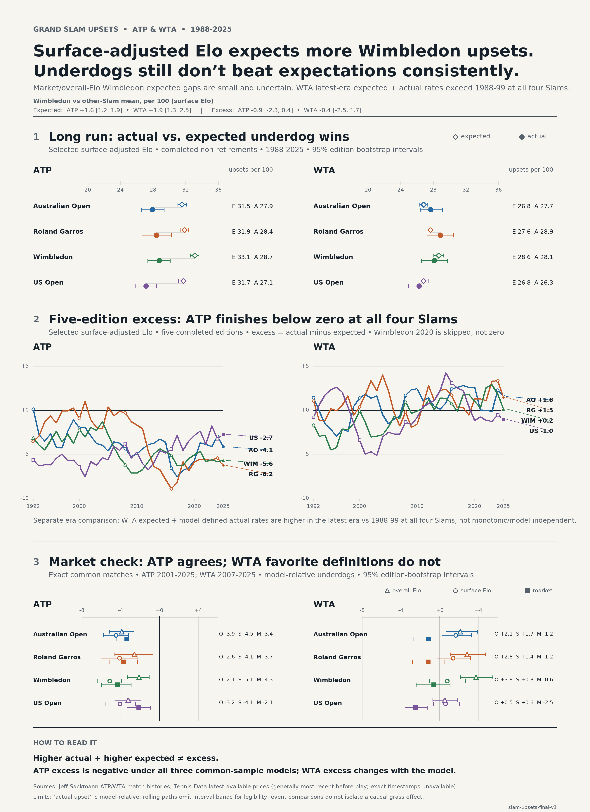

# tennis-lab

`tennis-lab` is a reproducible historical tennis research pipeline for asking:
at each Grand Slam, how many upsets do pre-match probabilities imply, how many
occur, do lower-probability players win more often than predicted, and how has
that changed since 1988?

The project keeps Australian Open, Roland Garros, Wimbledon, and US Open
separate, and never pools ATP and WTA in the primary analysis. It combines
leakage-safe overall/surface Elo with a separately audited betting-market
benchmark.

## Result

Selected surface-adjusted Elo expects Wimbledon to have more upset-prone
matchups than the equal-weight mean of the other Slams: +1.56 ATP and +1.87 WTA
expected upsets per 100 matches, with 95% joint-calendar bootstrap intervals of
[1.16, 1.90] and [1.30, 2.54]. That does **not** become unexplained excess:
Wimbledon-minus-other-Slam excess is -0.90 [-2.29, 0.38] for ATP and -0.44
[-2.48, 1.66] for WTA.

ATP excess is negative at every Slam under overall Elo, surface-adjusted Elo,
and market odds. WTA excess changes with the favorite definition. The selected
Elo forecast also has higher latest-era expected and model-defined actual WTA
rates than in 1988–1999 at all four Slams, but the path is not monotonic or
model-independent. None of these four-event comparisons identifies a causal
grass effect.



## Reproduce

Install [`uv`](https://docs.astral.sh/uv/). From the repository root, a single
command rebuilds the complete analysis when the locked raw files have already
been fetched:

```bash
uv run --frozen tennislab reproduce
```

A fresh checkout can fetch every missing source byte, verify it against the
tracked immutable locks, and rebuild the entire project with:

```bash
uv run --frozen tennislab reproduce --fetch
```

The fetch mode downloads 116 pinned Sackmann CSVs and 44 locked Tennis-Data
workbooks into gitignored `data/raw/`. Existing locks are never regenerated by a
fresh checkout: downloaded sizes and SHA-256 values must match exactly. Raw
source bytes are not edited or committed.

For setup or focused work:

```bash
uv sync --frozen
uv run --frozen pytest
uv run --frozen tennislab build-matches
uv run --frozen tennislab ratings
uv run --frozen tennislab analyze-slams
uv run --frozen tennislab analyze-odds
uv run --frozen tennislab robustness
uv run --frozen tennislab publish-figure
```

The full build is intentionally substantial: it validates 358,827 canonical
matches, generates more than one million chronological prediction rows, runs
2,000-replicate clustered uncertainty calculations, and replays alternative Elo
histories. The offline test/CI path uses fixtures and tracked aggregates, never
external downloads.

## Artifact layers

| Layer | Location | Git policy | Purpose |
|---|---|---|---|
| Immutable source | `data/raw/` | ignored | Exact locked match CSVs and odds workbooks |
| Generated detail | `data/processed/` | ignored | DuckDB, Parquet, and match-level analysis rows |
| Reviewed aggregate | `artifacts/data_audit/`, `artifacts/elo/`, `artifacts/slam_upsets/`, `artifacts/odds_benchmark/`, `artifacts/robustness/` | tracked | Audits, diagnostics, uncertainty, and synthesis inputs |
| Publication | `artifacts/publication/` | tracked | PNG, SVG, PDF, exact figure data, metadata, alt text, and source note |
| Frozen configuration | `config/` | tracked | Source locks, model parameters, aliases, robustness matrix, and figure config |

See the [output index](artifacts/README.md) for principal files and the
[architecture](docs/architecture.md) for stage boundaries and information flow.
The [canonical schema](docs/canonical_schema.md) documents normalized matches;
model cards document generated prediction layers.

## Integrity controls

- Every Elo value and probability is captured before applying the current match
  result; same-tour rows sharing an event start date are predicted from one
  frozen pre-date state.
- Model selection uses pre-1988 non-Slam outcomes. Principal 1988–2025 Slam
  results cannot affect selected parameters.
- Odds identities require exact context and reviewed, year-scoped aliases. Fuzzy
  proposals cannot create a match.
- Exact 50/50 rows remain proper-score observations but have no invented
  underdog.
- Tournament-edition bootstrap and rolling completed-edition windows preserve
  draw clustering and correctly skip the canceled Wimbledon 2020 event.
- The final graphic consumes reviewed aggregate CSVs only and records every
  input/config hash, byte hashes for portable outputs, and the decoded PNG pixel
  hash so platform zlib differences cannot masquerade as visual drift.

## Documentation

- [Architecture](docs/architecture.md)
- [Canonical schema](docs/canonical_schema.md)
- [Source provenance](docs/source_provenance.md)
- [Historical Elo methodology](docs/methodology/elo.md)
- [Slam upset metrics](docs/methodology/upset_metrics.md)
- [Betting-market methodology](docs/methodology/odds.md)
- [Four-Slam analysis and numerical checkpoints](analyses/slam_upsets/README.md)
- [Robustness synthesis](analyses/slam_upsets/results_synthesis.md)
- [Elo model card](docs/model_cards/elo-v1.md)
- [Market model card](docs/model_cards/market-odds-v1.md)
- [Robustness analysis card](docs/model_cards/slam-robustness-v1.md)
- [Rating-history scope decision](docs/decisions/0001-rating-history-scope.md)
- [Reproducibility/artifact decision](docs/decisions/0002-reproducibility-and-artifact-boundary.md)
- [Project status](PROJECT_STATUS.md)

## Licensing and citation

Repository code is MIT licensed. Jeff Sackmann's underlying match data is CC
BY-NC-SA 4.0 and requires attribution, non-commercial use, and share-alike
handling of covered derivatives. Tennis-Data raw workbooks are not redistributed
because their reuse terms do not provide a clear redistribution license. See
[licensing details](LICENSES.md), [source provenance](docs/source_provenance.md),
and [`CITATION.cff`](CITATION.cff) before redistributing data-derived outputs.

GitHub Actions installs frozen dependencies, runs the 96-test unit/fixture/hygiene
suite, rebuilds the publication smoke artifacts without external data, and fails
if tracked outputs change.
