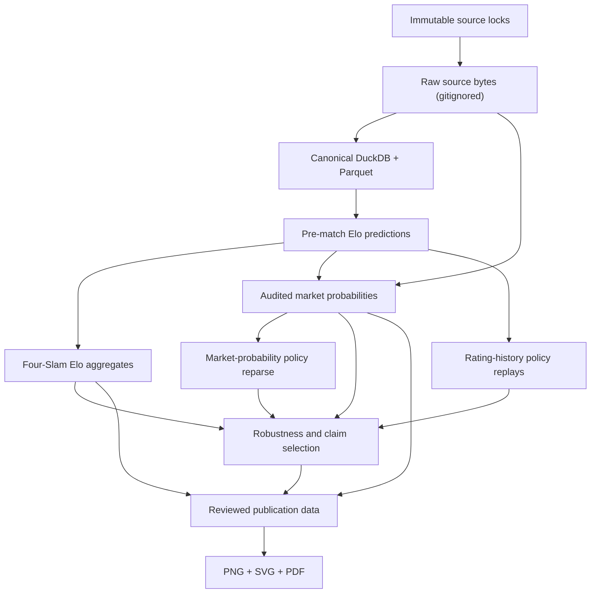

# Architecture and information flow

`tennis-lab` is organized as a sequence of deterministic stages with explicit
information boundaries. Modeling code lives under `src/tennislab/`; the
research entry points under `analyses/slam_upsets/` are thin wrappers over the
reusable package.

## Stages

| Stage | Command | Primary inputs | Primary outputs |
|---|---|---|---|
| Source retrieval | `tennislab fetch`, `tennislab fetch-odds` | tracked configs and immutable locks | `data/raw/` source bytes |
| Canonical build | `tennislab build-matches` | locked Sackmann CSVs | DuckDB/Parquet plus normalization issues |
| Data audit | `tennislab audit` | canonical DuckDB | coverage, counts, issues, readiness report |
| Rating pipeline | `tennislab ratings` | canonical matches and source lock | frozen model config, pre-match predictions, diagnostics |
| Slam analysis | `tennislab analyze-slams` | prediction Parquet | expected/actual/excess aggregates and clustered uncertainty |
| Market benchmark | `tennislab analyze-odds` | predictions, locked workbooks, reviewed aliases | matched market predictions, audits, common-sample aggregates |
| Rating-history sensitivity | `tennislab rating-history-sensitivities` | canonical chronology, frozen predictions/config, market common IDs | policy replays, selector checks, exact-panel aggregates |
| Market-probability sensitivity | `tennislab market-probability-sensitivities` | locked workbooks, reviewed aliases, frozen model panels | policy coverage, scores, contrasts, aggregate orientation changes |
| Robustness | `tennislab robustness` | canonical/prediction/market layers plus frozen config | alternative histories, contrasts, influence and synthesis tables |
| Publication | `tennislab publish-figure` | reviewed aggregate CSVs only | exact figure data, metadata, PNG, SVG, and PDF |

`tennislab reproduce` executes stages from the canonical build through both
sensitivity families, robustness, and publication. The
`tennislab reproduce --fetch` form first restores missing raw bytes from
the immutable locks. Both commands deterministically rerun pre-1988 Elo
selection and regenerate `config/elo_model.json`; any drift from the reviewed
config remains visible in Git. They do not rewrite source locks, aliases, or the
robustness matrix.

## Storage layers

### Raw

`data/raw/` is immutable and gitignored. Match CSVs and odds workbooks retain
their original bytes. The fetchers refuse to overwrite an existing mismatch and
refuse upstream bytes that differ from a tracked size or SHA-256.

### Processed

`data/processed/` is generated and gitignored. It contains:

- `tennislab.duckdb` and `matches.parquet`;
- `slam_player_experience.parquet`;
- `predictions.parquet` with overall, raw-surface, and adjusted-surface rows;
- `upset_matches.csv`;
- market and robustness match-level prediction/observation files.
- rating-history observations, market probability/pair details, and selector
  work directories used for exact independent reconstruction.

These files preserve detailed provenance but are too large or too restricted for
source control.

### Reviewed aggregate

Tracked `artifacts/` files are compact audits, model diagnostics, uncertainty
summaries, and reviewer-approved research results. They preserve source/config
hashes and can be inspected without rebuilding hundreds of megabytes of detail.
See the [output index](../artifacts/README.md).

### Publication

The publication renderer reads only four reviewed aggregate inputs named in
`config/final_figure.json`. It cannot resolve players, remove matches, update a
rating, or make model-selection decisions. `final_figure_data.csv` is the exact
tidy renderer input, and `final_figure_metadata.json` hashes every input, config,
and output.

## Information boundaries

- Ratings are separate by tour and generated in event-date batches. Every
  probability is emitted before results from that date update the state.
- The parameter selector removes all Slams before preparing state or metrics and
  evaluates only pre-1988 non-Slam outcomes.
- Odds matching may use outcome-oriented source columns only to restore player
  orientation after both identities match; probability magnitude is fixed by
  the pre-match price.
- Common-sample comparisons require one unique row for every expected
  `(match_id, model)` pair. Cross-model exclusions remove the union of affected
  match IDs.
- Retirement zero-result policy retains count/activity state, while strict skip
  removes participation history; probable-duplicate policies alter replay state
  only and never rewrite canonical rows.
- Market probability magnitude is determined entirely from pre-match odds and a
  serialized policy. Named-book minimum failures are audited and never imputed.
- Raw and malformed observations are retained and audited. Validation signals do
  not become silent filtering assumptions.

## Determinism

Source and dependency locks, fixed bootstrap seeds, total output ordering,
same-date rating batches, single-threaded fixed-precision diagnostic aggregates,
fixed model configs, atomic file replacement, bundled fonts, and invariant PDF
metadata make repeated builds reproducible. Provenance hashes canonical DuckDB
rows in a total order rather than hashing storage pages whose physical layout is
not semantic. CI exercises the fixture pipeline and rebuilds the publication
artifacts without contacting external sources.
